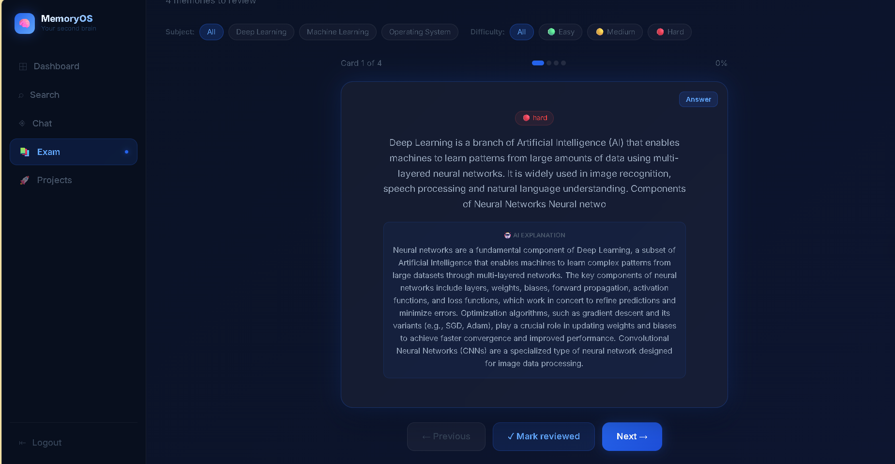

# MemoryOS  🧠

### Dashboard

### Semantic Search

### Chat with Memories (RAG)

### Upload Modal

### Exam Revision Flashcards

### Project Ideas Kanban

---

## What Makes It Different

| Traditional Search | MemoryOS |
|---|---|
| Finds exact keywords | Understands meaning and context |
| Returns keyword matches | Returns semantically related content |
| Dumb string matching | Vector embeddings + cosine similarity |

**Example:** Search "machine learning study notes" → finds your PDF titled "Neural Networks lecture" even though the words don't match.

---

## Features

- **Semantic Search** — Search by meaning using sentence-transformers embeddings
- **RAG Chat** — Ask questions, get AI answers grounded in your memories
- **Multi-format Upload** — Text, PDF, Word, PowerPoint, Images, URLs, Code
- **Auto Tagging** — AI generates relevant tags using Groq LLaMA
- **Code Snippets** — Language detection, monospace display
- **Exam Revision** — Flashcard mode with AI explanations at easy/medium/hard difficulty
- **Project Ideas** — Kanban board with drag-and-drop status tracking
- **Memory Timeline** — Group memories by Today, Yesterday, This Week
- **Tag Filtering** — Filter dashboard by any auto-generated tag
- **JWT Auth** — Secure per-user memory isolation

---

## Tech Stack

| Layer | Technology |
|---|---|
| Frontend | Next.js 14, React, TypeScript, Tailwind CSS |
| Backend | FastAPI, Python 3.11 |
| AI / Embeddings | sentence-transformers (all-MiniLM-L6-v2) |
| LLM | Groq LLaMA 3.3 70B (RAG Chat + Auto-tagging) |
| Vector Database | ChromaDB |
| Relational Database | PostgreSQL (Neon) |
| Deployment | Vercel (frontend), Render (backend) |

---

## How It Works
User uploads note or PDF
↓
Extract raw text
↓
Generate 384-dim embedding vector (all-MiniLM-L6-v2)
↓
Store vector in ChromaDB + metadata in PostgreSQL
↓
User searches in natural language
↓
Query → embedding → cosine similarity search
↓
Return semantically matched memories with similarity scores
↓
RAG Chat: top memories fed to LLaMA as context → AI answer

---

*Built by [Likith B](https://github.com/Likith11011) — B.Tech AIML, Alliance University*