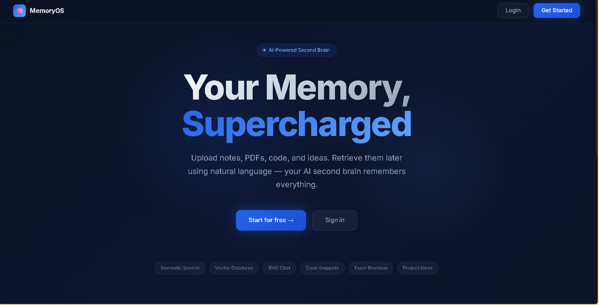
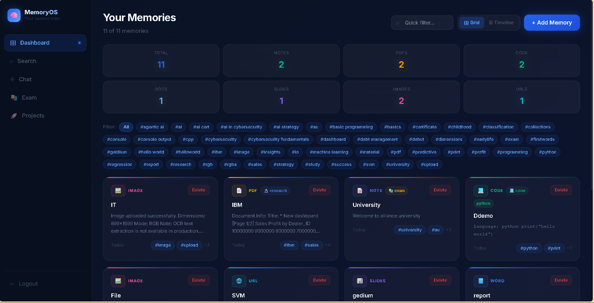
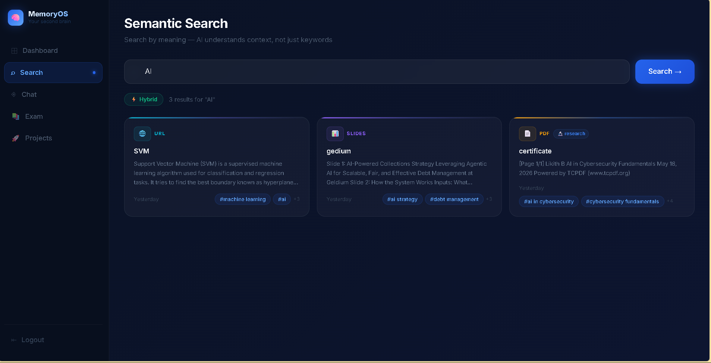
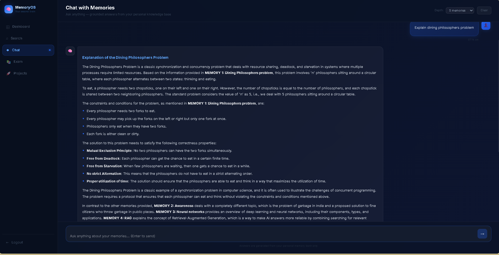
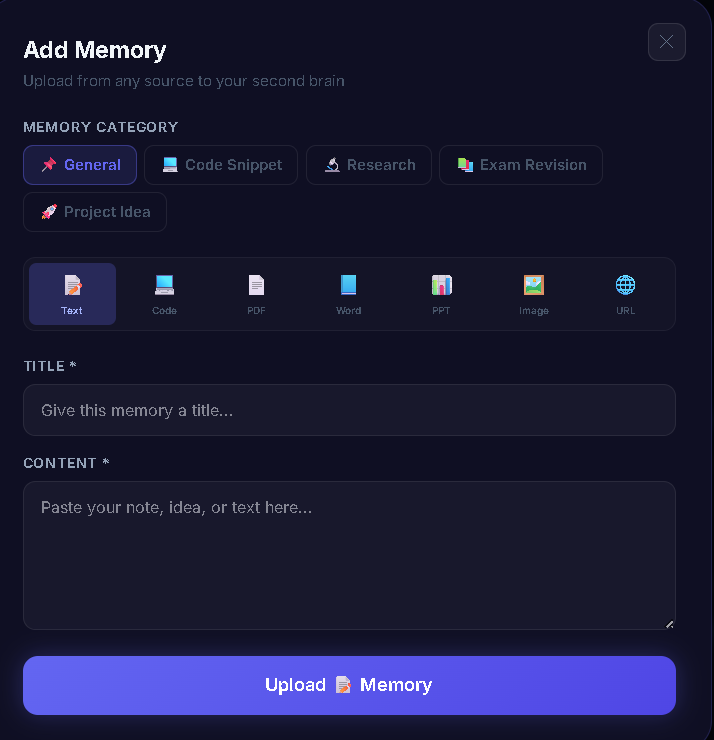
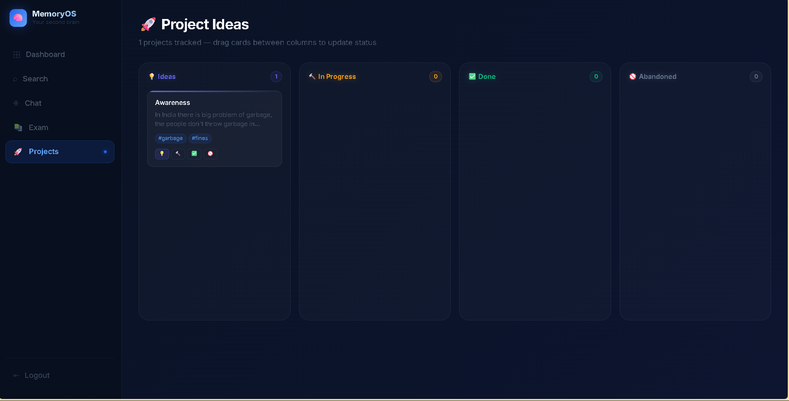

# MemoryOS 🧠

**An AI-Powered Contextual Semantic Memory Retrieval System**

> Most note apps let you search by keywords. MemoryOS understands meaning.

Upload notes, PDFs, code snippets, images, and web articles. Retrieve them later using natural language — your AI second brain remembers everything.

---

## Live Demo

- **Frontend:** https://memory-os-4pyc.vercel.app
- **Backend API:** https://memory-os-aid4.onrender.com/docs

---

## Screenshots

### Landing Page


### Dashboard


### Semantic Search


### Chat with Memories (RAG)


### Upload Modal


### Exam Revision Flashcards


### Project Ideas Kanban


---

## What Makes It Different

| Traditional Search | MemoryOS |
|---|---|
| Finds exact keywords | Understands meaning and context |
| Returns keyword matches | Returns semantically related content |
| Dumb string matching | Vector embeddings + cosine similarity |

**Example:** Search "machine learning study notes" → finds your PDF titled "Neural Networks lecture" even though the words don't match.

---

## Features

- **Semantic Search** — Search by meaning using sentence-transformers embeddings
- **RAG Chat** — Ask questions, get AI answers grounded in your memories
- **Multi-format Upload** — Text, PDF, Word, PowerPoint, Images, URLs, Code
- **Auto Tagging** — AI generates relevant tags using Groq LLaMA
- **Code Snippets** — Language detection, monospace display
- **Exam Revision** — Flashcard mode with AI explanations at easy/medium/hard difficulty
- **Project Ideas** — Kanban board with drag-and-drop status tracking
- **Memory Timeline** — Group memories by Today, Yesterday, This Week
- **Tag Filtering** — Filter dashboard by any auto-generated tag
- **JWT Auth** — Secure per-user memory isolation

---

## Tech Stack

| Layer | Technology |
|---|---|
| Frontend | Next.js 14, React, TypeScript, Tailwind CSS |
| Backend | FastAPI, Python 3.11 |
| AI / Embeddings | sentence-transformers (all-MiniLM-L6-v2) |
| LLM | Groq LLaMA 3.3 70B (RAG Chat + Auto-tagging) |
| Vector Database | ChromaDB |
| Relational Database | PostgreSQL (Neon) |
| Deployment | Vercel (frontend), Render (backend) |

---

## How It Works
User uploads note or PDF
↓
Extract raw text
↓
Generate 384-dim embedding vector (all-MiniLM-L6-v2)
↓
Store vector in ChromaDB + metadata in PostgreSQL
↓
User searches in natural language
↓
Query → embedding → cosine similarity search
↓
Return semantically matched memories with similarity scores
↓
RAG Chat: top memories fed to LLaMA as context → AI answer


---

## Architecture
┌─────────────────────────────────────────────────┐
│                  Next.js Frontend                │
│         (Vercel — memory-os-4pyc.vercel.app)     │
└──────────────────────┬──────────────────────────┘
│ REST API
┌──────────────────────▼──────────────────────────┐
│              FastAPI Backend (Render)            │
│  ┌─────────┐  ┌──────────┐  ┌────────────────┐  │
│  │  Auth   │  │ Memories │  │   Chat (RAG)   │  │
│  │  JWT    │  │  Routes  │  │  Groq LLaMA    │  │
│  └─────────┘  └────┬─────┘  └───────┬────────┘  │
└───────────────────┼─────────────────┼───────────┘
│                 │
┌───────────▼───┐     ┌───────▼────────┐
│  PostgreSQL   │     │   ChromaDB     │
│    (Neon)     │     │ Vector Store   │
│ Users/Memories│     │  Embeddings    │
└───────────────┘     └────────────────┘


---

## Getting Started Locally

### Prerequisites
- Node.js 20+
- Python 3.11+
- Git

### 1. Clone
```bash
git clone https://github.com/Likith11011/Memory-OS.git
cd Memory-OS
```

### 2. Backend
```bash
cd backend
python -m venv venv
venv\Scripts\activate        # Windows
source venv/bin/activate     # Mac/Linux
pip install -r requirements.txt
```

Create `backend/.env`:
SECRET_KEY=your-secret-key
DATABASE_URL=your-database-url
GROQ_API_KEY=your-groq-key


```bash
uvicorn main:app --reload
```

API runs at `http://localhost:8000`
Docs at `http://localhost:8000/docs`

### 3. Frontend
```bash
cd ..
npm install
```

Create `.env.local`:
NEXT_PUBLIC_API_URL=http://localhost:8000


```bash
npm run dev
```

App runs at `http://localhost:3000`

---

## API Overview

| Method | Endpoint | Description |
|---|---|---|
| POST | `/auth/signup` | Create account |
| POST | `/auth/login` | Login, receive JWT |
| POST | `/memories/upload` | Upload a memory |
| GET | `/memories/` | List all memories |
| GET | `/memories/search?q=` | Semantic search |
| POST | `/chat/` | Chat with memories (RAG) |
| DELETE | `/memories/{id}` | Delete a memory |

---

## AI Concepts Used

**Embeddings** — Text converted to 384-dimensional vectors that capture semantic meaning. Similar concepts produce similar vectors.

**Cosine Similarity** — Mathematical measure of angle between vectors. Used to find memories semantically close to the search query.

**Vector Database (ChromaDB)** — Optimized database for storing and searching high-dimensional vectors efficiently.

**RAG (Retrieval-Augmented Generation)** — Retrieve relevant memories → feed as context to LLaMA → generate grounded answers. Same technique used by Perplexity, Notion AI, and Google NotebookLM.

**Hybrid Search** — Combines semantic (vector) search with keyword search for best results.

---

## Why I Built This

Built as a 30-day AI engineering project during my 3rd year B.Tech AIML at Alliance University, Bengaluru.

The goal was to go beyond tutorial projects and implement real production AI techniques — vector databases, semantic embeddings, and RAG — in a complete, deployed system.

This project demonstrates practical knowledge of the same AI retrieval stack used by companies like Notion, Perplexity, and Anthropic.


*Built by [Likith B](https://github.com/Likith11011) — B.Tech AIML, Alliance University*
